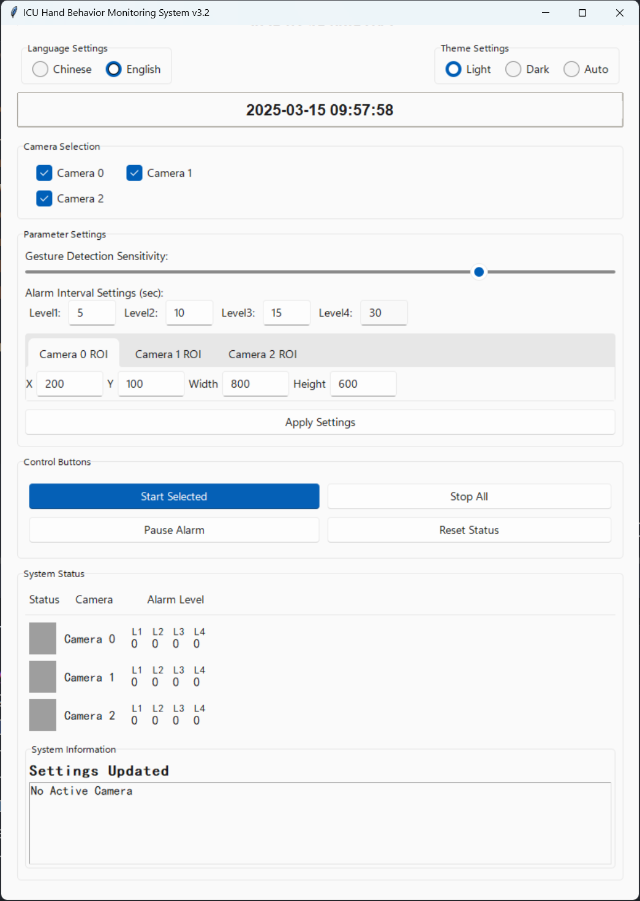
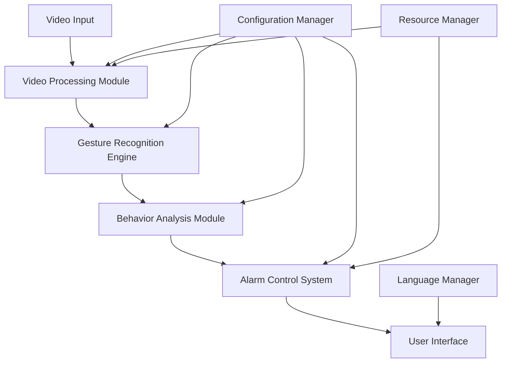
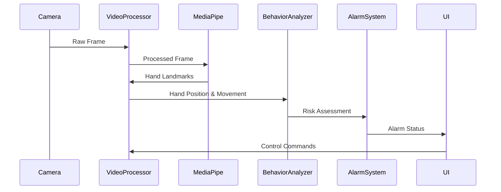

# ICU Hand Behavior Monitoring System v3.2 (Enterprise Edition)

[](https://github.com/yourusername/ICU_Mediapipe)
[](https://github.com/yourusername/ICU_Mediapipe)
[](https://github.com/yourusername/ICU_Mediapipe)
[](https://github.com/yourusername/ICU_Mediapipe/blob/main/LICENSE)
[](https://www.python.org/)
[](https://github.com/yourusername/ICU_Mediapipe/blob/main/CONTRIBUTING.md)
[](https://github.com/yourusername/ICU_Mediapipe/stargazers)
[](https://github.com/yourusername/ICU_Mediapipe/commits/main)

[English](README.md) | [中文](README.zh_CN.md)

## Overview

### Introduction
The ICU Hand Behavior Monitoring System is a professional-grade medical surveillance solution designed to enhance patient safety management in Intensive Care Units (ICU). The system employs advanced computer vision technology and deep learning algorithms to achieve real-time monitoring and intelligent early warning of patient risk behaviors, significantly reducing the occurrence of medical safety incidents.

This system addresses the critical challenge of monitoring ICU patients who may attempt to remove medical devices such as ventilators, catheters, or IV lines. By detecting specific hand movements and trajectories, the system can alert medical staff before patients harm themselves, providing a crucial safety layer in environments where continuous human monitoring is challenging.

### Core Advantages
- 🚀 **High Performance**: Optimized multi-threaded architecture supporting parallel processing of multiple camera feeds
- 🎯 **Precise Recognition**: High-accuracy hand keypoint detection based on MediaPipe with >95% recognition accuracy
- ⚡ **Real-time Response**: End-to-end latency <50ms, CPU usage <30%
- 🔔 **Intelligent Alerts**: Adaptive multi-level alarm mechanism with customizable thresholds
- 🛡️ **Enterprise-grade Reliability**: Comprehensive fault recovery and resource management mechanisms
- 🌐 **Multilingual Support**: Seamless switching between Chinese and English interfaces
- 🔄 **Continuous Monitoring**: 24/7 operation capability with automatic recovery from failures

### System Demo


*The system interface shows real-time camera feeds with hand tracking visualization, alarm status indicators, and control panel for system management.*

## Project Directory Structure

- `config.py` - System configuration file
- `main.py` - System main program entry
- `modules/` - Core system modules
  - `camera_manager.py` - Camera management module
  - `fps_counter.py` - FPS counter
  - `language.py` - Language support module
  - `video_processor.py` - Video processing module
  - `ui/` - User interface components
    - `components.py` - UI basic components
    - `control_panel.py` - Control panel
    - `language_selector.py` - Language selector
- `sounds/` - Audio and font resources
  - `5S报警音.wav` - 5-second alarm sound
  - `10S报警音.wav` - 10-second alarm sound
  - `15S报警音.wav` - 15-second alarm sound
  - `alarm.WAV` - 30-second emergency alarm sound
  - `fallback_beep.wav` - Fallback alarm sound
  - `simhei.ttf` - SimHei font file (for interface display)
- `data/` - Data and resource files
  - `UI.png` - System interface preview image
- `logs/` - Log files directory
  - `system.log` - System running log
- `docs/` - System documentation
  - `user_guide/` - User guide
  - `developer_guide/` - Developer guide

## Quick Start

### System Requirements
- **Operating Systems**: Windows 10/11, Ubuntu 20.04+, macOS 10.15+
- **Hardware Requirements**:
  - CPU: Intel Core i5 or equivalent (i7 recommended for multi-camera setups)
  - Memory: 8GB RAM (16GB recommended for optimal performance)
  - Camera: 720p or higher resolution USB camera (up to 3 cameras supported)
  - Storage: 500MB available space
  - Graphics: Integrated graphics sufficient (dedicated GPU improves performance)

### Installation

1. **Clone Repository**
```bash
git clone https://github.com/Trueysh/ICU-Hand-Behavior-Monitoring-System-v3.2
cd ICU_Mediapipe
```

2. **Create Virtual Environment**
```bash
python -m venv venv
source venv/bin/activate  # Linux/macOS
venv\Scripts\activate    # Windows
```

3. **Install Dependencies**
```bash
pip install -r requirements.txt
```

4. **Launch System**
```bash
python main.py
```

### Basic Configuration
Customize the following settings in `config.py`:
```python
# Camera Configuration
CAMERA_CONFIG = {
    "resolution": (1280, 720),
    "fps": 30,
    "roi": {"x": 0, "y": 0, "w": 1280, "h": 720},  # Region of interest
    "min_confidence": 0.7  # Detection confidence threshold
}

# Alarm Threshold Settings
ALARM_THRESHOLDS = {
    "level1": 5,   # 5 seconds - Initial warning
    "level2": 10,  # 10 seconds - Moderate alert
    "level3": 15,  # 15 seconds - Critical alert
    "level4": 30   # 30 seconds - Emergency alert
}

# Language Settings
LANGUAGE_PREFERENCE = "en_US"  # Options: "zh_CN", "en_US"
```

### Camera Setup
1. Connect USB cameras to your system
2. The system automatically detects connected cameras
3. Use the camera selector in the UI to choose which cameras to monitor
4. Adjust ROI (Region of Interest) for each camera to focus on patient bed areas

## Technical Architecture

### System Architecture

#### Component Diagram


#### Data Flow Diagram


### Project Structure
```
.
├── main.py                 # System entry point
├── config.py               # Configuration file
├── styles.py               # UI style definitions
├── modules/                # Function modules
│   ├── __init__.py         # Module initialization
│   ├── camera_manager.py   # Camera management
│   ├── fps_counter.py      # Performance monitoring
│   ├── video_processor.py  # Video processing
│   ├── language.py         # Multilingual support
│   └── ui/                 # Interface components
│       ├── __init__.py     # UI module initialization
│       ├── components.py   # Reusable UI components
│       ├── control_panel.py # Main control interface
│       └── language_selector.py # Language selection UI
├── data/                   # Static resources
│   └── UI.png              # UI screenshot
├── sounds/                 # Audio resources
│   ├── 5S报警音.wav        # 5-second alarm sound
│   ├── 10S报警音.wav       # 10-second alarm sound
│   ├── 15S报警音.wav       # 15-second alarm sound
│   ├── alarm.WAV           # General alarm sound
│   └── fallback_beep.wav   # Fallback sound
├── logs/                   # Log files
│   └── system.log          # System operation logs
├── docs/                   # Documentation
│   ├── user_guide/         # User guides
│   ├── developer_guide/    # Developer guides
│   └── i18n/               # Internationalization docs
├── tests/                  # Test files
│   └── test_video_processor.py # Video processor tests
├── requirements.txt        # Production dependencies
├── requirements-dev.txt    # Development dependencies
├── CONTRIBUTING.md         # Contribution guidelines
├── LICENSE                 # MIT License
├── README.md               # Project documentation (English)
└── README.zh_CN.md         # Project documentation (Chinese)
```

## Development Guide

### Coding Standards
- Follow [PEP 8](https://peps.python.org/pep-0008/) coding conventions
- Use type annotations (PEP 484) for all function parameters and return values
- Document all classes and functions with docstrings (PEP 257)
- Write unit tests for all new functionality
- Maintain code coverage >90%
- Use consistent naming conventions

## API Documentation

### Video Processing Module
```python
class VideoProcessor:
    def process_frame(frame: np.ndarray) -> tuple:
        """Process single frame
        Args:
            frame: Input image frame
        Returns:
            processed_frame: Processed frame
            hand_landmarks: Hand keypoints
        """
        pass
```

### Alarm Control Module
```python
class AlarmController:
    def check_alarm_condition(hand_position: tuple, roi: dict) -> bool:
        """Check if alarm condition is triggered
        Args:
            hand_position: Hand position coordinates
            roi: Region of interest
        Returns:
            bool: Whether alarm is triggered
        """
        pass
```

## Contributing

Contributions are welcome! Please read the [contribution guidelines](CONTRIBUTING.md) to learn how to participate in the project.

## License

This project is licensed under the MIT License. See the [LICENSE](LICENSE) file for details.

## Contact

If you have any questions or suggestions, please contact us:
- Submit a [GitHub Issue](https://github.com/yourusername/ICU_Mediapipe/issues)
- Send an email to: example@example.com

---

© 2024 ICU_Mediapipe Team. All rights reserved.
