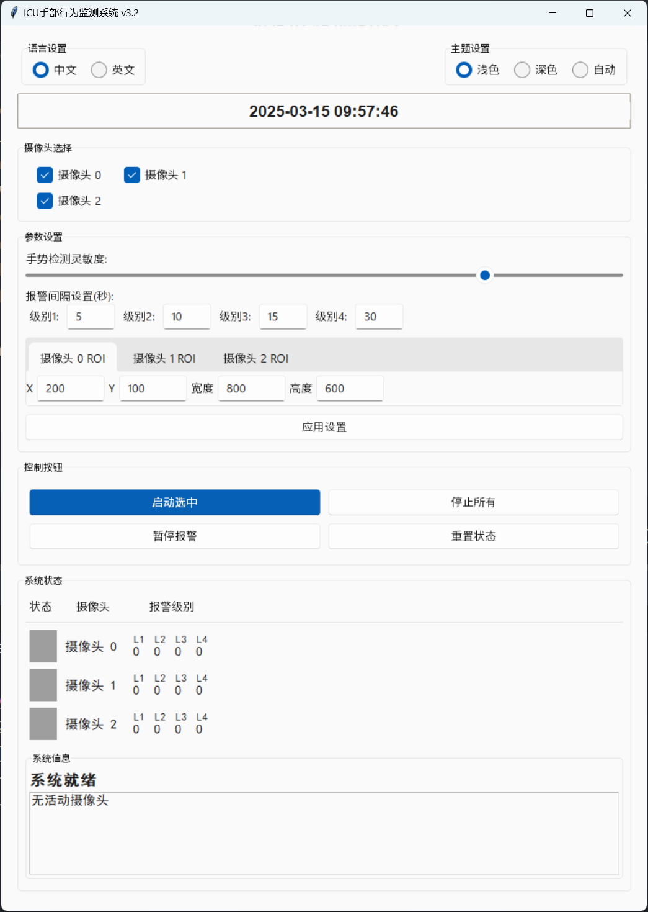
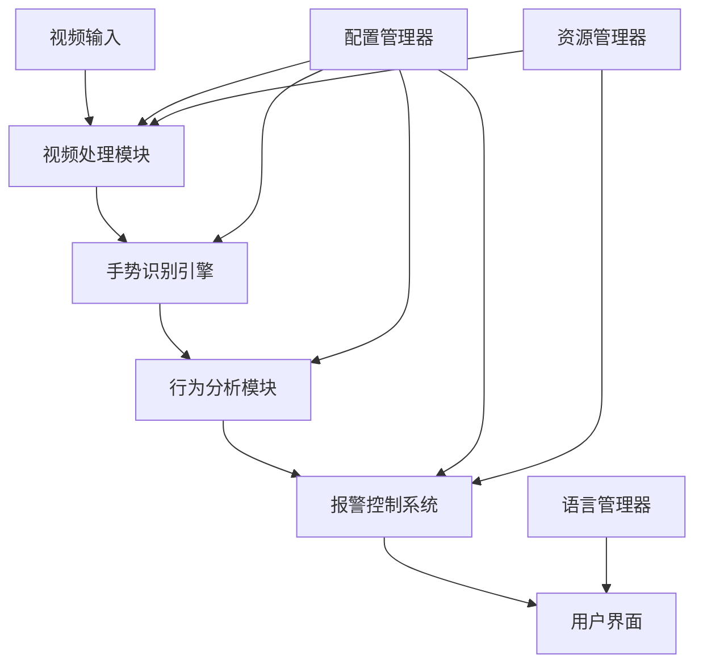
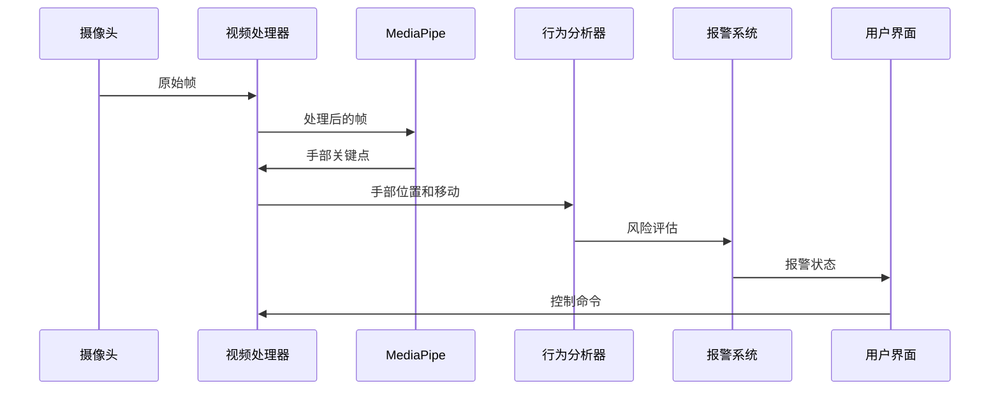

# ICU手部行为监测系统 v3.2 (企业版)

[](https://github.com/yourusername/ICU_Mediapipe)
[](https://github.com/yourusername/ICU_Mediapipe)
[](https://github.com/yourusername/ICU_Mediapipe)
[](https://github.com/yourusername/ICU_Mediapipe/blob/main/LICENSE)
[](https://www.python.org/)
[](https://github.com/yourusername/ICU_Mediapipe/blob/main/CONTRIBUTING.md)
[](https://github.com/yourusername/ICU_Mediapipe/stargazers)
[](https://github.com/yourusername/ICU_Mediapipe/commits/main)

[English](README.md) | 中文

## 概述

### 介绍
ICU手部行为监测系统是一款专业级医疗监控解决方案，旨在提升重症监护病房(ICU)的患者安全管理。系统采用先进的计算机视觉技术和深度学习算法，实现对患者风险行为的实时监控和智能预警，显著降低医疗安全事故的发生率。

本系统解决了监控ICU患者可能尝试移除医疗设备（如呼吸机、导管或输液管）的关键挑战。通过检测特定的手部动作和轨迹，系统能够在患者伤害自己之前提醒医护人员，在人工持续监控具有挑战性的环境中提供关键的安全保障。

### 核心优势
- 🚀 **高性能**：优化的多线程架构支持多路摄像头并行处理
- 🎯 **精准识别**：基于MediaPipe的高精度手部关键点检测，识别准确率>95%
- ⚡ **实时响应**：端到端延迟<50ms，CPU占用<30%
- 🔔 **智能报警**：自适应多级报警机制，阈值可定制
- 🛡️ **企业级可靠性**：全面的故障恢复和资源管理机制
- 🌐 **多语言支持**：中英文界面无缝切换
- 🔄 **持续监控**：支持24/7运行，自动从故障中恢复

### 系统演示



*系统界面展示实时摄像头画面，包含手部跟踪可视化、报警状态指示器和系统管理控制面板。*

## 项目目录结构

- `config.py` - 系统配置文件
- `main.py` - 系统主程序入口
- `modules/` - 系统核心模块
  - `camera_manager.py` - 摄像头管理模块
  - `fps_counter.py` - 帧率计数器
  - `language.py` - 语言支持模块
  - `video_processor.py` - 视频处理模块
  - `ui/` - 用户界面组件
    - `components.py` - UI基础组件
    - `control_panel.py` - 控制面板
    - `language_selector.py` - 语言选择器
- `sounds/` - 音频和字体资源
  - `5S报警音.wav` - 5秒报警音效
  - `10S报警音.wav` - 10秒报警音效
  - `15S报警音.wav` - 15秒报警音效
  - `alarm.WAV` - 30秒紧急报警音效
  - `fallback_beep.wav` - 备用报警音效
  - `simhei.ttf` - 黑体字体文件（用于界面显示）
- `data/` - 数据和资源文件
  - `UI.png` - 系统界面预览图
- `logs/` - 日志文件目录
  - `system.log` - 系统运行日志
- `docs/` - 系统文档
  - `user_guide/` - 用户指南
  - `developer_guide/` - 开发者指南

## 快速开始

### 系统要求
- **操作系统**：Windows 10/11, Ubuntu 20.04+, macOS 10.15+
- **硬件要求**：
  - CPU：Intel Core i5或同等性能（多摄像头设置推荐i7）
  - 内存：8GB RAM（推荐16GB以获得最佳性能）
  - 摄像头：720p或更高分辨率USB摄像头（最多支持3个摄像头）
  - 存储：500MB可用空间
  - 显卡：集成显卡足够（独立GPU可提升性能）

### 安装

1. **克隆仓库**
```bash
git clone https://github.com/yourusername/ICU_Mediapipe.git
cd ICU_Mediapipe
```

2. **创建虚拟环境**
```bash
python -m venv venv
source venv/bin/activate  # Linux/macOS
venv\Scripts\activate    # Windows
```

3. **安装依赖**
```bash
pip install -r requirements.txt
```

4. **启动系统**
```bash
python main.py
```

### 基本配置
在`config.py`中自定义以下设置：
```python
# 摄像头配置
CAMERA_CONFIG = {
    "resolution": (1280, 720),
    "fps": 30,
    "roi": {"x": 0, "y": 0, "w": 1280, "h": 720},  # 感兴趣区域
    "min_confidence": 0.7  # 检测置信度阈值
}

# 报警阈值设置
ALARM_THRESHOLDS = {
    "level1": 5,   # 5秒 - 初始警告
    "level2": 10,  # 10秒 - 中度警报
    "level3": 15,  # 15秒 - 严重警报
    "level4": 30   # 30秒 - 紧急警报
}

# 语言设置
LANGUAGE_PREFERENCE = "zh_CN"  # 选项: "zh_CN", "en_US"
```

### 摄像头设置
1. 将USB摄像头连接到系统
2. 系统会自动检测已连接的摄像头
3. 使用UI中的摄像头选择器选择要监控的摄像头
4. 为每个摄像头调整ROI（感兴趣区域）以聚焦于病床区域

## 技术架构

### 系统架构

#### 组件图


#### 数据流图


### 项目结构
```
.
├── main.py                 # 系统入口点
├── config.py               # 配置文件
├── styles.py               # UI样式定义
├── modules/                # 功能模块
│   ├── __init__.py         # 模块初始化
│   ├── camera_manager.py   # 摄像头管理
│   ├── fps_counter.py      # 性能监控
│   ├── video_processor.py  # 视频处理
│   ├── language.py         # 多语言支持
│   └── ui/                 # 界面组件
│       ├── __init__.py     # UI模块初始化
│       ├── components.py   # 可复用UI组件
│       ├── control_panel.py # 主控制界面
│       └── language_selector.py # 语言选择UI
├── data/                   # 静态资源
│   └── UI.png              # UI截图
├── sounds/                 # 音频资源
│   ├── 5S报警音.wav        # 5秒报警音
│   ├── 10S报警音.wav       # 10秒报警音
│   ├── 15S报警音.wav       # 15秒报警音
│   ├── alarm.WAV           # 通用报警音
│   └── fallback_beep.wav   # 备用音效
├── logs/                   # 日志文件
│   └── system.log          # 系统运行日志
├── docs/                   # 文档
│   ├── user_guide/         # 用户指南
│   ├── developer_guide/    # 开发者指南
│   └── i18n/               # 国际化文档
├── tests/                  # 测试文件
│   └── test_video_processor.py # 视频处理器测试
├── requirements.txt        # 生产依赖
├── requirements-dev.txt    # 开发依赖
├── CONTRIBUTING.md         # 贡献指南
├── LICENSE                 # MIT许可证
├── README.md               # 项目文档(英文)
└── README.zh_CN.md         # 项目文档(中文)
```

## 开发指南

### 编码标准
- 遵循[PEP 8](https://peps.python.org/pep-0008/)编码规范
- 为所有函数参数和返回值使用类型注解(PEP 484)
- 为所有类和函数添加文档字符串(PEP 257)
- 为所有新功能编写单元测试
- 保持代码覆盖率>90%
- 使用一致的命名约定

## API文档

### 视频处理模块
```python
class VideoProcessor:
    def process_frame(frame: np.ndarray) -> tuple:
        """处理单帧图像
        Args:
            frame: 输入图像帧
        Returns:
            processed_frame: 处理后的帧
            hand_landmarks: 手部关键点
        """
        pass
```

### 报警控制模块
```python
class AlarmController:
    def check_alarm_condition(hand_position: tuple, roi: dict) -> bool:
        """检查是否触发报警条件
        Args:
            hand_position: 手部位置坐标
            roi: 感兴趣区域
        Returns:
            bool: 是否触发报警
        """
        pass
```

## 贡献

欢迎贡献！请阅读[贡献指南](CONTRIBUTING.md)了解如何参与项目。

## 许可证

本项目采用MIT许可证。详情请参阅[LICENSE](LICENSE)文件。

## 联系我们

如有任何问题或建议，请通过以下方式联系我们：
- 提交[GitHub Issue](https://github.com/yourusername/ICU_Mediapipe/issues)
- 发送电子邮件至：example@example.com

---

© 2024 ICU_Mediapipe 团队。保留所有权利。