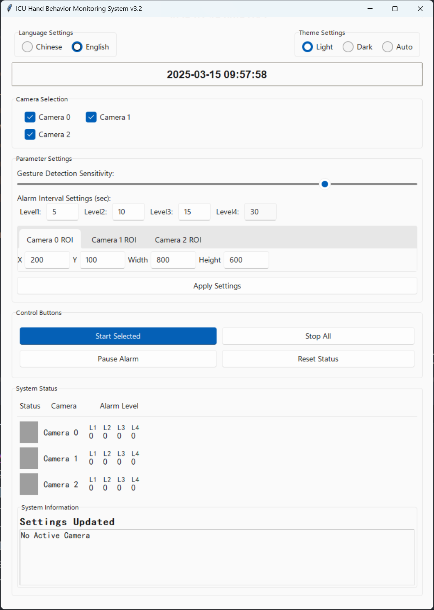
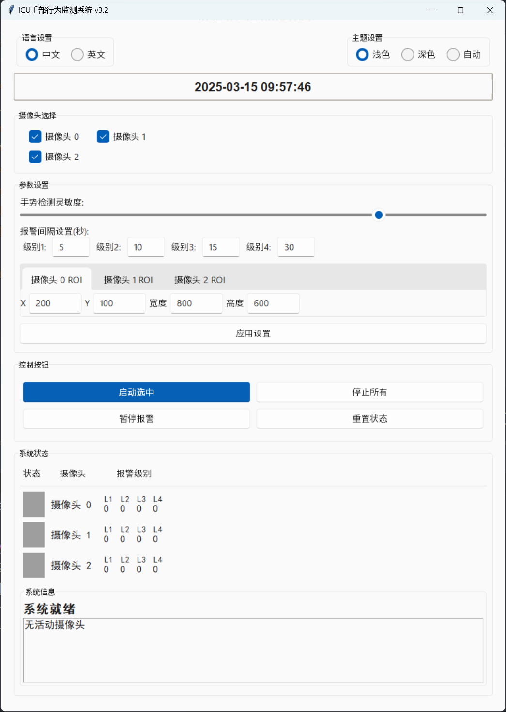

# 使用说明

本文档提供ICU手部行为监测系统的详细使用指南。

## 系统启动

1. 确保所有摄像头已正确连接到计算机
2. 打开命令行终端，进入系统目录
3. 激活虚拟环境（如果使用）：
   ```bash
   # Windows
   venv\Scripts\activate
   
   # Linux/macOS
   source venv/bin/activate
   ```
4. 运行主程序：
   ```bash
   python main.py
   ```
5. 系统将自动初始化并显示主界面

## 界面概述

系统界面主要分为以下几个部分：

1. **摄像头显示区域**：显示实时摄像头画面和手部跟踪
2. **控制面板**：包含系统控制按钮和状态显示
3. **设置面板**：用于调整系统参数和配置
4. **状态栏**：显示系统运行状态和信息

## 基本操作

### 摄像头选择

1. 在控制面板中找到「摄像头选择」区域
2. 勾选要启用的摄像头（最多支持3个）
3. 点击「启动选中」按钮开始监控

### 调整ROI（感兴趣区域）

1. 在设置面板中找到「ROI设置」区域
2. 为每个摄像头设置适当的ROI参数：
   - X：ROI左上角的X坐标
   - Y：ROI左上角的Y坐标
   - 宽度：ROI的宽度
   - 高度：ROI的高度
3. 点击「应用设置」按钮保存更改

### 调整手势灵敏度

1. 在设置面板中找到「手势检测灵敏度」滑块
2. 向右拖动增加灵敏度，向左拖动降低灵敏度
3. 点击「应用设置」按钮保存更改

### 调整报警间隔

1. 在设置面板中找到「报警间隔设置」区域
2. 为每个报警级别设置适当的时间间隔（秒）
3. 点击「应用设置」按钮保存更改

## 监控操作

### 启动监控

1. 选择要监控的摄像头
2. 点击「启动选中」按钮
3. 系统将开始实时监控所选摄像头

### 停止监控

1. 点击「停止所有」按钮
2. 系统将停止所有摄像头的监控

### 暂停报警

1. 当报警触发时，点击「暂停报警」按钮
2. 系统将暂时停止声音报警，但继续监控

### 重置状态

1. 点击「重置状态」按钮
2. 系统将清除当前的报警状态并重新开始计时

## 界面设置

### 系统界面预览

系统提供中英文两种界面，以下是界面预览：

#### 英文界面


#### 中文界面


### 切换语言

1. 在控制面板中找到「语言设置」区域
2. 选择